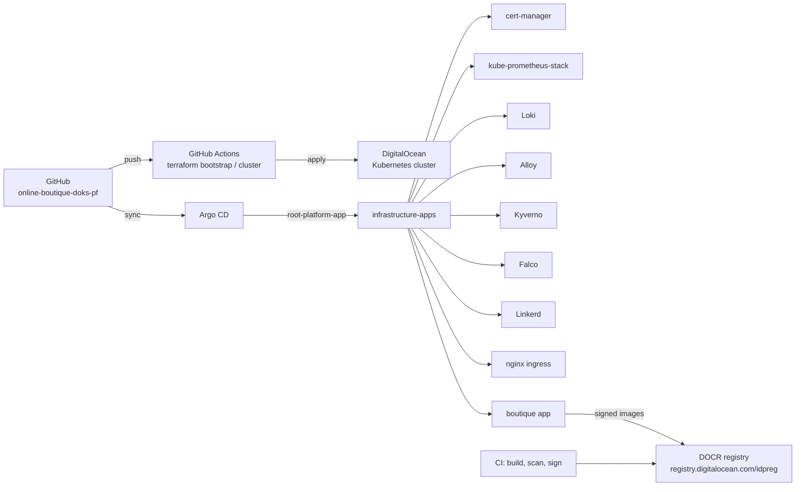
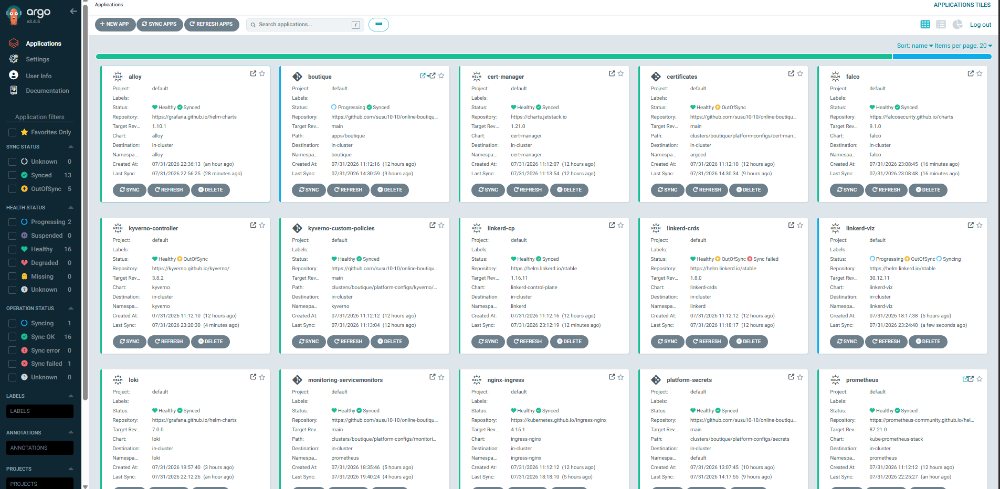

# Online Boutique Platform (DOKS + GitOps)


A production-style platform for the Google Online Boutique microservices demo on DigitalOcean Kubernetes (DOKS), managed end to end with GitOps. Argo CD is the only thing that changes the cluster: every component, from cert-manager to the boutique workloads themselves, is declared in this repository and synced automatically.

The platform covers the full lifecycle: signed container images built in CI, policy enforcement at admission time, runtime security monitoring, network microsegmentation, a service mesh with `mTLS`, `centralized logging`, `metrics`, `alerting`, and automated `TLS`. Everything runs on a single DOKS node and is designed to be rebuilt from scratch by running two Terraform stacks and applying one Argo CD Application.

## Features

- **GitOps deployment with Argo CD** the root Application watches this repo; all 17 child Applications `self-heal` and `prune`
- **Observability stack** `kube-prometheus-stack` (Prometheus, Grafana, Alertmanager) with custom ServiceMonitors and dashboards
- **Centralized logging** `Grafana Alloy DaemonSet` shipping container logs to Loki, queried from Grafana
- **Service mesh** `Linkerd` control plane, data plane, and viz with automatic proxy injection
- **Runtime security** `Falco` DaemonSet with the modern `eBPF` driver watching syscalls on every node
- **Policy enforcement** seven Kyverno policies (CEL ValidatingPolicies and ClusterPolicy) covering Pod Security Standards, probes, resources, and image tags
- **Automated TLS** `cert-manager` with a Let's Encrypt ClusterIssuer, HTTP-01 challenges through nginx ingress
- **Monitoring and alerting** `PrometheusRule` sets for the boutique workloads, the `cluster`, `nginx`, `cert-manager`, and `GitOps` health
- **Image signing and verification** CI signs every image with `Cosign`; the verification policy and public key are defined in the repo
- **Secrets management** sealed-secrets for encrypted-at-rest secrets in Git, plus a Vault values file ready to enable
- **Network microsegmentation** deny-all default with per-service allow rules in the boutique namespace

## Architecture



GitHub Actions runs the Terraform stacks that create the cluster and install Argo CD. Argo CD then takes over: it reads the infrastructure Applications from this repo and syncs every platform component. The boutique images are built, scanned with Trivy, and signed with Cosign in CI (the `online-boutique-app` repository), pushed to the DigitalOcean Container Registry, and pinned by SHA tag in `apps/boutique/kustomization.yaml`.

## Technologies

| Layer | Technology | Version | Notes |
|---|---|---|---|
| Cluster | DigitalOcean Kubernetes (DOKS) | `1.35` | 1 node, Cilium CNI, registry integration |
| IaC | Terraform | `1.15` | Two stacks: bootstrap (cluster), cluster (in-cluster) |
| GitOps | Argo CD | `10.2.1` (chart) | Root app + child apps, sync waves, self-heal |
| Ingress | ingress-nginx | `4.15.1` (chart) | LoadBalancer, security headers, metrics |
| Certificates | cert-manager | `1.21.0` (chart) | Let's Encrypt staging ClusterIssuer, HTTP-01 |
| Service mesh | Linkerd | `1.16.11` (chart) | mTLS identity via cert-manager issuer |
| Policies | Kyverno | `3.8.2` (chart) | 7 deployed policies, Audit mode |
| Runtime security | Falco | `9.1.0` (chart) | modern eBPF driver, DaemonSet |
| Metrics | kube-prometheus-stack | `87.21.0` (chart) | Prometheus, Grafana, Alertmanager |
| Logging | Loki | `7.0.0` (chart) | SingleBinary, filesystem storage, 20Gi |
| Log shipping | Grafana Alloy | `1.10.1` (chart) | DaemonSet, static cluster label |
| Secrets | sealed-secrets | `2.19.1` (chart) | Encrypted SealedSecrets in Git |
| Registry | DigitalOcean Container Registry | - | `idpreg`, SHA-pinned tags |
| Signing | Cosign | - | Private key in CI, public key in repo |

## Deployment

The cluster is rebuilt from this repo in three steps:

1. **Bootstrap the cluster**: `terraform bootstrap` creates the DOKS cluster (`boutique-doks`). Run it from `terraform/bootstrap/` (or push to `main`, which triggers the `terraform-main.yml` workflow).

2. **Configure the cluster**: `terraform cluster` reads the existing cluster via a `digitalocean_kubernetes_cluster` data source, creates the platform namespaces (including `boutique` with the `linkerd.io/inject=enabled` label), and installs Argo CD with the `argo-cd` Helm chart. Run it from `terraform/cluster/`; the `terraform-cluster.yml` workflow runs it automatically after the bootstrap workflow succeeds.

3. **Hand over to GitOps**:

> Connect to the `DOKS` cluster and run the command below to kickstart the GitOps

```bash
kubectl apply -f clusters/boutique/argocd/root-app.yaml
```

The root Application (`root-platform-app`) watches `clusters/boutique/infrastructure-apps/` and syncs every platform component in dependency order (sync waves 0 through 10): sealed-secrets and cert-manager first, then the observability stack, Kyverno, Linkerd, nginx, the boutique workloads, and finally platform secrets. From that point on, Argo CD is the only writer to the cluster.

## Repository structure

```text
online-boutique-doks-pf/
├── apps/
│   └── boutique/                  # Boutique workloads (kustomize)
│       ├── kustomization.yaml     # SHA-pinned images, imagePullSecrets patch
│       └── network-policies/      # deny-all + per-service + linkerd + acme
├── clusters/
│   └── boutique/
│       ├── argocd/                # root app, project, Argo CD values
│       ├── infrastructure-apps/   # 17 Argo CD Applications (the platform)
│       └── platform-configs/
│           ├── cert-manager/      # letsencrypt + linkerd identity issuers
│           ├── helm-values/       # values for every Helm chart
│           ├── kyverno/           # cosign.pub + deployed policies
│           ├── monitoring/        # PrometheusRules + ServiceMonitors
│           └── secrets/           # sealed Grafana credentials
├── terraform/
│   ├── bootstrap/                 # creates the DOKS cluster
│   └── cluster/                   # namespaces + Argo CD install
├── .github/workflows/             # terraform-main, terraform-cluster, cleanup
└── docs/
    ├── security.md                # security architecture and controls
    └── operations.md              # operational lessons from real incidents
```

## Documentation

- [Docs index](docs/README.md) the platform documentation set
- [Architecture](docs/architecture.md) repo layout, GitOps flow, bootstrap flow, App-of-Apps
- [Observability](docs/observability.md) metrics, logs, alerts, dashboards
- [Security](docs/security.md) admission policies, supply chain, runtime security, network policies, TLS, Linkerd mTLS
- [Operations](docs/operations.md) every incident that shaped this repo, with issue, diagnosis, and resolution

## Lessons learned

This platform is the result of a long list of real failures, each documented in [docs/operations.md](docs/operations.md). The short version: deny-all NetworkPolicies block ACME solvers and service meshes, Helm charts do not generate CA material for you, Kyverno CEL reads namespaces from `object.metadata.namespace`, and Argo CD cannot resolve `HEAD` as a revision. Read the full stories before you touch a restrictive policy or a Helm values file.

## Screenshots

- Argo CD application tree (`argocd.suworks.me`)



- Grafana dashboard (metrics and Loki logs, `grafana.suworks.me`)


