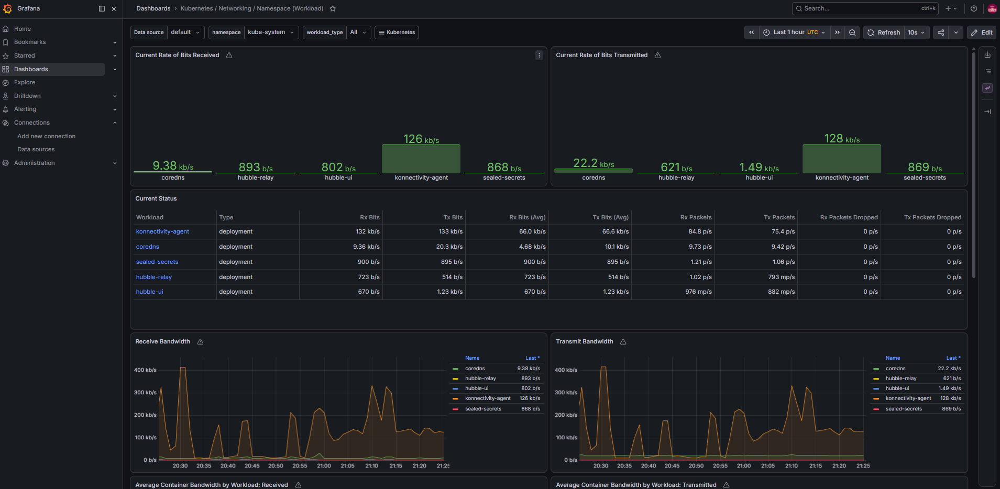

# online-boutique-doks-pf

A production-inspired Kubernetes platform built on GitOps principles.

This is the platform half of a two-repo GitOps setup. Terraform provisions a DigitalOcean Kubernetes (DOKS) cluster and installs Argo CD. After bootstrap, Argo CD manages everything from this repository: infrastructure components, monitoring, policy, and the Online Boutique application. The application half lives in the `online-boutique-app` repository, which builds, scans, signs, and pushes container images.

## Features

- GitOps deployment with Argo CD (App-of-Apps pattern, auto-sync, prune, self-heal)
- Observability stack: Prometheus, Grafana, kube-state-metrics, node-exporter
- Centralized logging: Loki with Grafana Alloy as the log agent (DaemonSet)
- Service mesh: Linkerd with mTLS, identity via cert-manager, linkerd-viz dashboards
- Runtime security: Falco (eBPF driver, JSON output)
- Policy enforcement: Kyverno with seven custom cluster policies
- Automated TLS: cert-manager with a Let's Encrypt ClusterIssuer (HTTP-01)
- Monitoring and alerting: recording rules, alerting rules, Alertmanager
- Image signature verification: Cosign verification policy defined in the repo, currently disabled
- Secrets: [redacted]
- Per-service NetworkPolicies with a deny-all default (apps/boutique/network-policies)

Accuracy notes on two items:

- The Cosign verification policy is `clusters/boutique/platform-configs/disabled/verify-image-sig.yaml`. It is a Kyverno ClusterPolicy in Audit mode and is not enforced today. The application pipeline (online-boutique-app) does sign images with Cosign.
- Vault has helm values (`platform-configs/helm-values/vault.yaml`, HA Raft config) and a bootstrap stub (`terraform/bootstrap/vault-bootstrap.tf`), but no Argo CD Application. It is defined in the repo, not running.
- Tempo files exist as empty placeholders. No tracing pipeline is configured.

## Documentation

- [architecture.md](architecture.md) - repo layout, GitOps flow, bootstrap flow, App-of-Apps pattern, application request flow
- [observability.md](observability.md) - metrics, logs, alerts, dashboards
- [security.md](security.md) - layered security: Kyverno policies, Falco, NetworkPolicies, TLS, mTLS, image verification
- [operations.md](operations.md) - operational lessons and debugging write-ups

## Screenshots

Placeholder blocks. Each image links to `docs/diagrams/`. Capture the view from the live cluster and commit the PNG.

| Screenshot | Location | Status |
|------------|----------|--------|
|  | `docs/diagrams/argocd-application-tree.png` | TODO: capture from live cluster |
|  | `docs/diagrams/grafana-dashboard.png` | TODO: capture from live cluster |
|  | `docs/diagrams/linkerd-dashboard.png` | TODO: capture from live cluster |
|  | `docs/diagrams/prometheus-targets.png` | TODO: capture from live cluster |
|  | `docs/diagrams/loki-explore.png` | TODO: capture from live cluster |

## Tech stack

| Component | Role | Where it is declared |
|-----------|------|----------------------|
| Terraform | Provisions the DOKS cluster, DNS, namespaces, and the Argo CD install | `terraform/` |
| DOKS | Managed Kubernetes (1 node, s-4vcpu-8gb, K8s 1.35) | `terraform/bootstrap/main.tf` |
| Argo CD | GitOps engine; syncs everything from git | `terraform/cluster/main.tf`, `clusters/boutique/argocd/` |
| Helm | Chart-based deployment of infrastructure apps | Argo CD applications |
| Kustomize | Composes the boutique app manifests | `apps/boutique/kustomization.yaml` |
| ingress-nginx | Ingress controller behind a DO LoadBalancer | `infrastructure-apps/nginx-ingress.yaml` |
| cert-manager | TLS certificates (Let's Encrypt, Linkerd identity) | `infrastructure-apps/cert-manager.yaml` |
| Linkerd | Service mesh with mTLS and viz dashboards | `infrastructure-apps/linkerd-crds.yaml`, `linkerd-cp.yaml`, `linkerd-viz.yaml` |
| Kyverno | Policy engine for workloads | `infrastructure-apps/kyverno.yaml` |
| Vault | Secrets management (defined in repo, not deployed) | `platform-configs/helm-values/vault.yaml` |
| Falco | Runtime security monitoring | `infrastructure-apps/falco.yaml` |
| Prometheus | Metrics collection and alert evaluation | `infrastructure-apps/kube-prometheus-stack.yaml` |
| Grafana | Dashboards; Loki as a data source | same chart, `helm-values/kube-prom-stack.yaml` |
| Loki | Log storage and query (SingleBinary) | `infrastructure-apps/loki.yaml` |
| Alloy | Log collection from pods (DaemonSet) | `infrastructure-apps/alloy.yaml` |
| Cosign | Image signing (app repo) and verification (disabled policy) | `platform-configs/disabled/verify-image-sig.yaml` |
| SealedSecrets | Encrypted secrets at rest in git | `infrastructure-apps/sealed-secrets.yaml` |

## Repository structure

```
online-boutique-doks-pf/
├── terraform/
│   ├── bootstrap/              # DOKS cluster, DNS records, project resources
│   └── cluster/                # Namespaces + Argo CD Helm install (in-cluster config)
├── clusters/
│   └── boutique/
│       ├── argocd/             # Argo CD values, root app, AppProject
│       ├── infrastructure-apps/ # App-of-Apps children: one Application per component
│       └── platform-configs/   # Helm values, Kyverno policies, monitoring rules, secrets
├── apps/
│   └── boutique/               # Kustomize manifests for the storefront services
├── .github/workflows/          # Terraform bootstrap + cluster CI/CD
└── docs/                       # This documentation set
```

## Related repositories

- [online-boutique-app](https://github.com/susu10-10/online-boutique-app) - application source, CI pipeline (build, Trivy scan, Cosign sign, push to DigitalOcean Container Registry), and the kustomization handoff.
