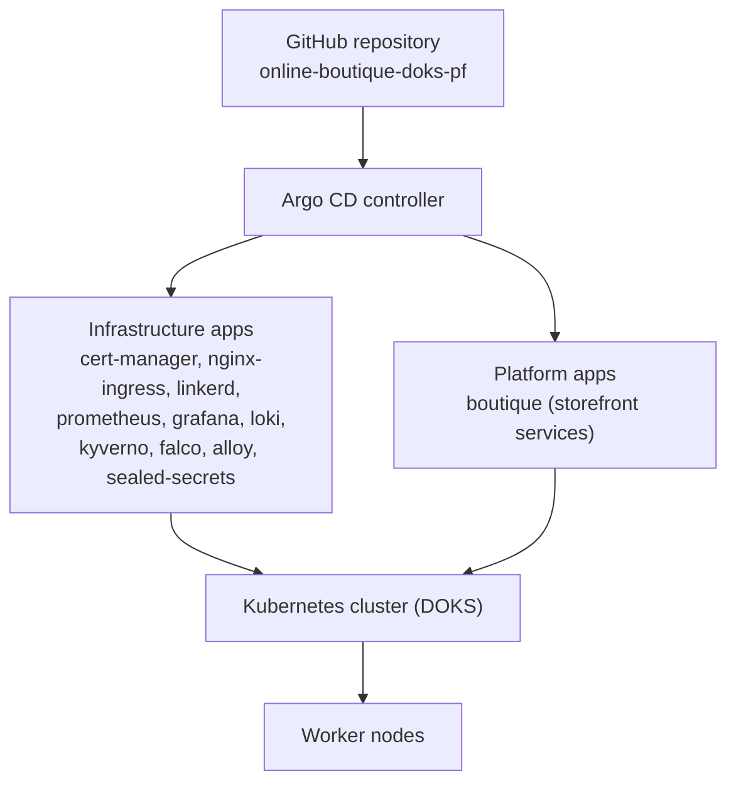
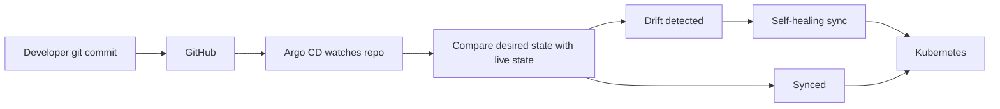
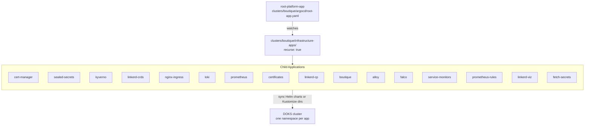
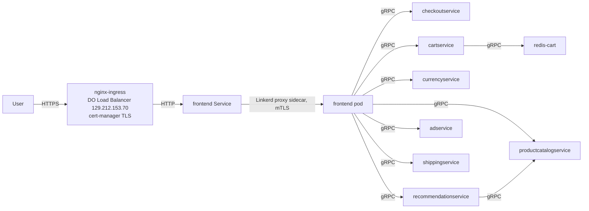

# Architecture

This repository is the platform half of a two-repo GitOps architecture. It declares the Kubernetes cluster, the GitOps engine, the infrastructure components, and the application manifests. Everything in the cluster is either created by Terraform during bootstrap or synced by Argo CD from git after bootstrap.

## System overview

Argo CD is the single control point. It reads Application manifests from this repository and reconciles the cluster against them. Infrastructure apps install platform components. The boutique app deploys the Online Boutique storefront.

## The GitOps control loop

Every Argo CD Application in this repo uses the same sync policy:

- `automated.prune: true` - resources removed from git are deleted from the cluster
- `automated.selfHeal: true` - manual changes in the cluster are reverted to the git state
- `syncOptions.CreateNamespace=true` - target namespaces are created on demand

The result is a closed loop. Git is the source of truth. A commit is the only way to change the cluster, and drift does not survive the next reconciliation.

### Sync waves

Applications declare `argocd.argoproj.io/sync-wave` annotations to order installation:

| Wave | Applications |
|------|--------------|
| 0 | `sealed-secrets`, `cert-manager` |
| 1 | `kyverno-controller`, `linkerd-crds` |
| 2 | `nginx-ingress`, `loki`, `prometheus` (kube-prometheus-stack), `certificates`, `kyverno-custom-policies` |
| 3 | `linkerd-cp`, `boutique`, `prometheus-rules` |
| 4 | `linkerd-viz` |
| 10 | `platform-secrets` |

## The two-repo split

Two repositories with one contract between them.

- `online-boutique-app` owns the application source and the CI pipeline. The pipeline runs unit tests, builds images, scans them with Trivy, signs them with Cosign, and pushes them to a DigitalOcean Container Registry (`idpreg`). It never touches the cluster.
- `online-boutique-doks-pf` (this repo) owns the platform and the deployment state. Terraform builds the cluster, Argo CD deploys everything, and the boutique manifests pin the exact images to run.

The contract is `apps/boutique/kustomization.yaml`. The app repo pipeline updates the image tags in that file, commits, and Argo CD does the rest. The current contract:

- Image names follow `registry.digitalocean.com/idpreg/<service>` with immutable SHA tags (`newTag: sha-...`). No `latest` tags.
- A Kustomize patch attaches the `idpreg` imagePullSecret to every Deployment.
- All resources land in the `boutique` namespace and carry the `app.kubernetes.io/part-of: online-boutique` label.
- The kustomization includes 11 service manifests plus `network-policies/`, a per-service NetworkPolicy set with a deny-all default.

## App-of-Apps pattern

`clusters/boutique/argocd/root-app.yaml` defines the root application, `root-platform-app`:

- Source: this repo, path `clusters/boutique/infrastructure-apps`, `recurse: true`
- Destination: the local cluster (`https://kubernetes.default.svc`)
- Auto-sync with prune and self-heal

Argo CD scans that directory and treats every Application manifest inside it as a child app. The root app is the entry point; the children do the work. The pattern makes the whole platform one declarative tree: delete the root app and everything it manages is removed (the root app carries the `resources-finalizer.argocd.argoproj.io` finalizer).

The children are a mix of two source types:

- Helm charts with values from `clusters/boutique/platform-configs/helm-values/`, using the `$values` ref to point at this repo (for example `loki chart 7.0.0`, `kube-prometheus-stack 87.21.0`, `ingress-nginx 4.15.1`, `falco 9.1.0`, `alloy 1.10.1`).
- Plain directories in this repo (kyverno policies, monitoring rules, secrets).

Active applications in `infrastructure-apps/`:

- `sealed-secrets`, `cert-manager`, `kyverno`, `linkerd-crds`, `nginx-ingress`, `loki`, `prometheus`, `certificates`, `linkerd-cp`, `boutique`, `alloy`, `falco`, `service-monitors`, `prometheus-rules`, `linkerd-viz`, `fetch-secrets`

`clusters/boutique/argocd/project.yaml` defines an AppProject named `boutique` that scopes source repositories and destination namespaces. The current applications declare `project: default`; the AppProject file is the scoping template for tighter RBAC.

## Bootstrap flow

Terraform handles everything up to the moment Argo CD can take over. Two stacks run in order, each driven by a GitHub Actions workflow.

```mermaid
flowchart LR
    subgraph boot["terraform/bootstrap/"]
        direction TB
        p["provider.tf<br/>digitalocean 2.95.0"]
        b["backend.tf<br/>DO Spaces bucket idp-tf"]
        v["variable.tf<br/>node s-4vcpu-8gb"]
        m["main.tf<br/>DOKS cluster boutique-doks<br/>Kubernetes 1.35"]
        o["outputs.tf<br/>kubeconfig (sensitive)"]
    end
    boot -->|"terraform apply"| wf1["GitHub Actions<br/>terraform-main.yml"]
    wf1 --> online["Cluster online"]
    online -->|"workflow_run on success"| wf2["GitHub Actions<br/>terraform-cluster.yml"]
    wf2 --> data["data source boutique-cluster<br/>kubernetes 3.2.1, helm 3.2.0"]
    data --> ns["Namespaces<br/>argocd, platform, boutique<br/>boutique: linkerd.io/inject=enabled"]
    ns --> helm["helm_release<br/>argo-cd 10.2.1"]
    helm --> argocd["Argo CD takes over<br/>syncs root-platform-app"]
```

1. `terraform/bootstrap/` (workflow `terraform-main.yml`):
   - Creates the DOKS cluster `boutique-doks` (`Kubernetes 1.35`, one node of size `s-4vcpu-8gb`, registry integration enabled, Sunday maintenance window).
   - Creates DNS: an A record for the domain root pointing at the load balancer IP, plus a wildcard CNAME.
   - Associates the cluster with the DigitalOcean project.

2. `terraform/cluster/` (workflow `terraform-cluster.yml`, runs after the bootstrap workflow succeeds):
   - Reads the cluster by name (`boutique-doks`) and configures the kubernetes and helm providers from its kubeconfig data. This is how the two stacks chain together.
   - Creates the namespaces: `argocd`, `platform`, and `boutique` (the boutique namespace carries the `linkerd.io/inject: enabled` label).
   - Installs Argo CD with the `argo-cd` Helm chart (version 10.2.1), using `clusters/boutique/argocd/values.yaml`. Those values enable metrics on all Argo CD components and expose the UI at `argocd.suworks.me` through nginx-ingress with a cert-manager-issued certificate.

After that, the handoff is complete. Argo CD syncs `root-platform-app`, which deploys every infrastructure component in dependency order via sync waves. From this point on, no Terraform and no CI job touches the cluster. All changes flow through git.

## Application request flow

> Note: Linkerd Viz collects golden metrics from every proxy.

- The user reaches the storefront over HTTPS. 
- nginx-ingress terminates TLS with a cert-manager-issued certificate and forwards to the frontend Service. 
- Linkerd injects a proxy sidecar into the frontend pod, so every hop between pods is encrypted with mTLS. 
- The frontend calls seven backend services over gRPC: checkoutservice, cartservice, productcatalogservice, currencyservice, recommendationservice, adservice, and shippingservice. 
- Two dependencies sit behind those: cartservice uses redis-cart, and recommendationservice reads from productcatalogservice.

## Repository Layout Explained

One line per entry, accurate as of `2026-08-07`.

### apps/

- `apps/boutique/`: Kustomize base for the 11 Online Boutique microservices.
  - `kustomization.yaml`: sets namespace `boutique`, adds label `app.kubernetes.io/part-of: online-boutique`, lists 12 service manifests plus `network-policies/`, patches `imagePullSecrets: idpreg` onto every Deployment, and pins 10 images to `registry.digitalocean.com/idpreg/*` with SHA tags (redis is not pinned).
  - `<service>.yaml` (12): frontend, adservice, cartservice, checkoutservice, emailservice, paymentservice, productcatalogservice, recommendationservice, shippingservice, currencyservice, redis; each is a hardened Deployment (`runAsNonRoot`, drop ALL capabilities, `readOnlyRootFilesystem`, `linkerd.io/inject: enabled`) plus a Service and a ServiceAccount.
  - `network-policies/`: kustomization plus 16 policy files; per-service allow rules under a deny-all default.
    - `kustomization.yaml`: resource list for the policy set.
    - `network-policy-deny-all.yaml`: deny-all ingress and egress for the boutique namespace.
    - `network-policy-acme-solver.yaml`: allows the ingress-nginx namespace to reach `acme.cert-manager.io/http01-solver` pods on TCP 8089.
    - per-service allow policies (12): adservice, cartservice, checkoutservice, currencyservice, emailservice, frontend, paymentservice, productcatalogservice, recommendationservice, redis-cart, shippingservice, loadgenerator; each allows that service's own ingress and egress.
    - `linkerd/`: mesh-specific allowances.
      - `allow-linkerd-proxy.yaml`: opens proxy ports 4143 and 4191.
      - `allow-linkerd-control-plane.yaml`: egress to the linkerd namespace on ports 8086, 8088, and 9995.
      - `kustomization.yaml`: resource list for the linkerd policies.

### clusters/

- `clusters/boutique/argocd/`: Argo CD bootstrap configuration.
  - `root-app.yaml`: defines `root-platform-app`; watches `clusters/boutique/infrastructure-apps/` with `recurse: true`, auto-sync with prune and self-heal, cascading-delete finalizer.
  - `project.yaml`: AppProject `boutique`; scopes source repositories and destination namespaces. Current apps declare `project: default`; this is the template for tighter RBAC.
  - `values.yaml`: argo-cd Helm values; domain `argocd.suworks.me`, nginx ingress, cert-manager letsencrypt-staging issuer, metrics enabled on all components.
- `clusters/boutique/infrastructure-apps/`: 17 Application YAMLs, the children of the root app.
  - Active apps: sealed-secrets, cert-manager, kyverno, linkerd-crds, nginx-ingress, loki, prometheus, certificates, linkerd-cp, boutique, alloy, falco, service-monitors, prometheus-rules, linkerd-viz, fetch-secrets. `kyverno.yaml` holds two Applications: `kyverno-controller` (Helm chart 3.8.2) and `kyverno-custom-policies` (the policies directory).
  - `tempo.yaml`: empty placeholder. No tracing pipeline is configured.
- `clusters/boutique/platform-configs/`: configuration consumed by the child applications.
  - `cert-manager/`: issuers for TLS and Linkerd identity.
    - `letsencrypt-issuer.yaml`: ClusterIssuer `letsencrypt-staging`, HTTP-01, `ingressClassName: nginx`.
    - `linkerd-issuer.yaml`: self-signed ClusterIssuer plus trust anchor, Issuer, and the identity issuer chain for Linkerd.
  - `helm-values/`: one values file per chart: nginx-ingress, cert-manager, kyverno, falco, vault, loki, alloy, kube-prom-stack, linkerd, sealed-secrets. `tempo.yaml` is a placeholder.
  - `kyverno/`: Kyverno policy source.
    - `policies/`: seven active ClusterPolicies: require-nonroot, drop-all-capabilities, require-probes, require-resource-limits, require-readonly-rootf, restrict-latest-tag, restrict-seccomp. The eighth (verify-image-signature) is parked in `disabled/`, see below.
    - `cosign.pub`: ECDSA P-256 public key used to verify image signatures.
  - `disabled/`: configuration moved out of the active path.
    - `verify-image-sig.yaml`: Cosign verification ClusterPolicy (Audit mode). Moved here temporarily during DOCR credential work; intended to be restored to `policies/`.
    - `idpregcred-sealed.yaml`: sealed image-pull secret for the DOCR registry.
    - `kube-prom.yaml`: placeholder for kube-prometheus-stack overrides.
    - `rules.yaml`: monitoring rules, disabled.
  - `monitoring/`: Prometheus configuration for the cluster.
    - `servicemonitors/`: ServiceMonitor resources that define platform scraping targets.
    - `recording-rules/`: recording rules for dashboards and alerts.
    - `alerting-rules/`: alert rules, including `gitops-alert.yaml` (Argo CD Application health alerts).
  - `secrets/`: sealed secrets consumed by the `platform-secrets` (fetch-secrets) app: `grafanasealed.yaml`, `grafana-cred.yaml`.

### terraform/

- `terraform/bootstrap/`: first stack; creates the cluster and DNS.
  - `provider.tf`: digitalocean provider 2.95.0; token comes from the `DIGITALOCEAN_TOKEN` env var.
  - `backend.tf`: S3-compatible remote state on DO Spaces, bucket `idp-tf`, key `state/doks-main/terraform.tfstate`.
  - `variable.tf`: variables: region (nyc3), domain (suworks.me), node_size (s-4vcpu-8gb), lb_ip, DO and Spaces credentials.
  - `main.tf`: DOKS cluster `boutique-doks` (Kubernetes 1.35, one `s-4vcpu-8gb` node, registry integration, Sunday maintenance window) and DigitalOcean project association.
  - `dns.tf`: domain resource, A record for the root pointing at the load balancer IP, wildcard CNAME.
  - `outputs.tf`: cluster id, endpoint, name, kubeconfig (sensitive), CA certificate.
  - `terraform.auto.tfvars`: `lb_ip = "129.212.153.70"`.
  - `argocd.tf`, `namespaces.tf`, `secrets-bootstrap.tf`, `vault-bootstrap.tf`: empty stubs. The bootstrap stack does not create these resources.
- `terraform/cluster/`: second stack; configures inside the cluster.
  - `main.tf`: namespaces `argocd`, `platform`, and `boutique` (with `linkerd.io/inject: enabled`), plus the `argo-cd` Helm release 10.2.1 using `clusters/boutique/argocd/values.yaml`.
  - `provider.tf`: digitalocean, kubernetes 3.2.1, helm 3.2.0; the `boutique-cluster` data source reads the cluster by name and feeds the providers.
  - `variable.tf`: `do_token`.
  - `backend.tf`: S3-compatible remote state on DO Spaces, bucket `idp-tf`, key `state/doks-cluster/terraform.tfstate`.

### .github/

- `.github/workflows/`: Terraform CI/CD.
  - `terraform-main.yml`: "Terraform DOKS Main"; runs on push to main touching `terraform/bootstrap/**` (or the workflow itself) and on manual dispatch; init, validate, plan, then apply.
  - `terraform-cluster.yml`: "Terraform DOKS Cluster"; chained via `workflow_run` on "Terraform DOKS Main" success, plus manual dispatch; init, validate, plan, apply.
  - `cleanup.yml`: "Destroy Infrastructure"; manual dispatch with a `confirm` input; runs `terraform destroy` on the bootstrap stack when `confirm == destroy`.

### Misc

- `scripts/`: not present in this repo. The documented `vault-bootstrap.sh` (Vault init/unseal helper) does not exist.
- `.vscode/settings.json`: stale YAML schema-detection references; harmless.
- `docs/`: this documentation set.
  - `README.md`: entry point, features, doc index, screenshots.
  - `architecture.md`: this document.
  - `observability.md`: metrics, logs, alerts, dashboards.
  - `security.md`: layered security controls.
  - `operations.md`: operational lessons.
- `README.md` (root): repository entry point.
- `.gitignore`: standard ignores.
