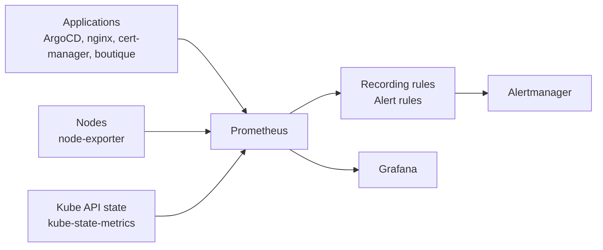
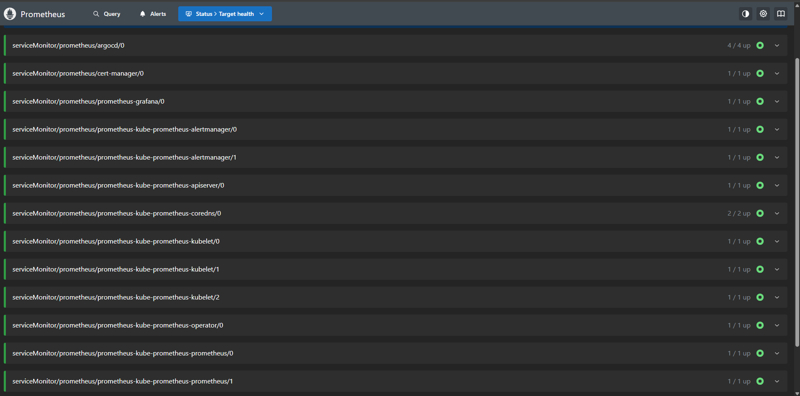
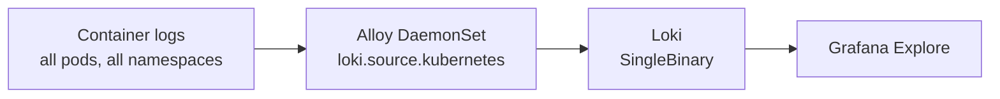
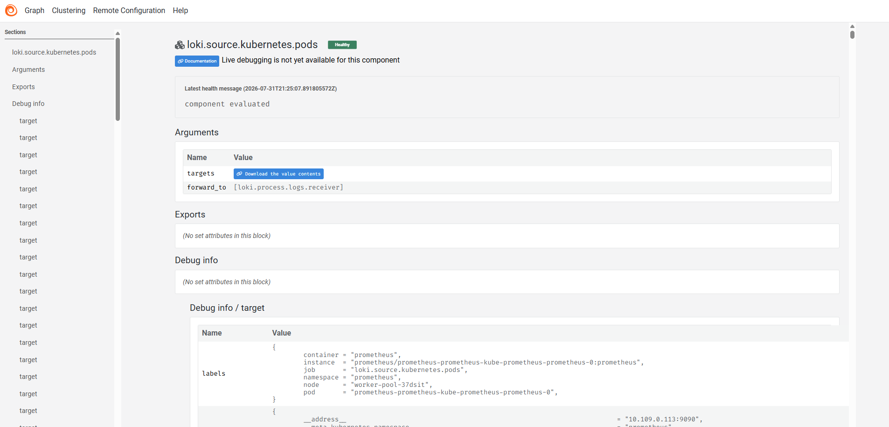
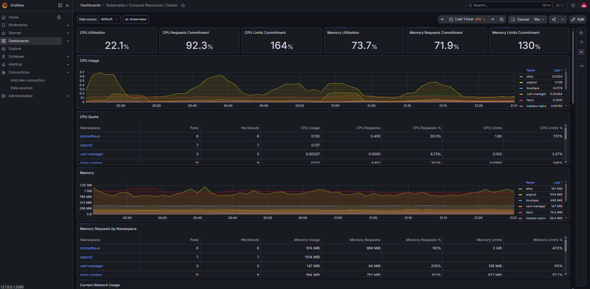
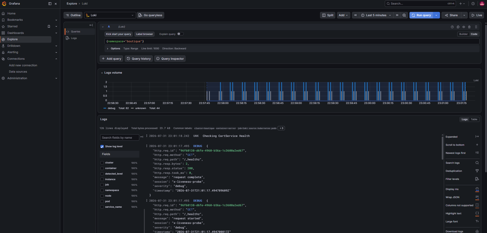

# Observability

This platform runs a Prometheus-based metrics stack and a Loki-based logging stack, deployed and configured entirely through Argo CD. The monitoring configuration lives in `clusters/boutique/platform-configs/monitoring/` and is synced as Argo CD applications.

One scope note: tracing is not wired up. `tempo.yaml` exists as an empty placeholder file in `infrastructure-apps/` and `helm-values/`, but no tracing pipeline is configured. This document covers `metrics`, `logs`, `alerts`, and `dashboards`.

## Metrics

The `prometheus` Argo CD application installs the `kube-prometheus-stack` chart (version 87.21.0) into the `prometheus` namespace. Key settings from `platform-configs/helm-values/kube-prom-stack.yaml`:

- Prometheus: single replica, `scrapeInterval` and `evaluationInterval` of 30 seconds, retention of 7 days capped at `10 GB`, `10 GiB PVC`.
- node-exporter enabled (node metrics), kube-state-metrics enabled (Kubernetes object state).
- Grafana with 5 GiB persistence and an nginx ingress at `grafana.suworks.me` (TLS via the `letsencrypt-staging` ClusterIssuer).
- Alertmanager enabled.

### What gets scraped

ServiceMonitors declare scrape targets with the `release: prometheus` label so the Prometheus operator picks them up:

- `argocd-monitor.yaml` - Argo CD metrics (port `http-metrics`, 30s interval). Argo CD values enable metrics on the server, application controller, repo server, and ApplicationSet controller.
- `cert-monitor.yaml` - cert-manager metrics on port `http-metrics`, 30s interval.
- ingress-nginx enables `metrics.serviceMonitor` in its helm values, so nginx metrics are scraped as well.
- Linkerd ships its own metrics. `linkerd-viz` runs a separate Prometheus and Grafana inside the mesh with tap and a metrics API; the mesh dashboard is separate from the main Grafana instance.

### Rules

The `prometheus-rules` application syncs two directories as PrometheusRule CRs:

- `monitoring/recording-rules/` - precomputed series, for example `argocd:applications:total`, `argocd:applications:synced`, `argocd:applications:out_of_sync`, `gitops:applications_unhealthy`, `argocd:app_reconcile_rate`. Files cover gitops, nginx, linkerd, cert-manager, workload, and boutique-specific rules.
- `monitoring/alerting-rules/` - alert expressions, for example `ArgoCDApplicationOutOfSync` (firing after 15 minutes out of sync), `ArgoCDApplicationDegraded` (critical), `ArgoCDSyncFailed`, `ArgoCDControllerDown`, plus cluster, workload, nginx, cert-manager, and boutique alerts.

> Alertmanager is enabled in the chart values, but no external receiver is configured in the repo. Rules evaluate and fire; routing to a notification channel is not declared here.

## Logs

The repo does not use `Promtail`. Log collection is handled by Grafana Alloy, installed by the `alloy` Argo CD application (chart version 1.10.1) as a DaemonSet in the `alloy` namespace. Its config in `platform-configs/helm-values/alloy.yaml`:

- `discovery.kubernetes` with `role = "pod"` discovers all pods in the cluster.
- `discovery.relabel` copies namespace, pod name, container name, and node name onto every log stream as labels.
- `loki.source.kubernetes` reads container logs and forwards them to `loki.process`.
- `loki.process` adds a static label `cluster = "boutique"` and forwards to `loki.write`.
- `loki.write` pushes to `http://loki-gateway.loki.svc.cluster.local/loki/api/v1/push`.

Loki is installed by the `loki` Argo CD application (chart version 7.0.0) into the `loki` namespace. Values from `platform-configs/helm-values/loki.yaml`:

- `deploymentMode: SingleBinary` with one replica (no separate read/write/backend components).
- Filesystem storage with a 20 GiB PVC and a 168 hour retention period.
- Authentication disabled; schema v13 with the TSDB store.

> Grafana gets Loki as an additional data source (`additionalDataSources`, URL `http://loki.loki:3100`), so log queries run in Grafana Explore. The Alloy configuration means every log line is searchable by namespace, pod, container, node, and cluster.

## Metrics vs logs vs alerts vs dashboards

- Metrics are numeric time series: counters, gauges, and histograms scraped on an interval. They answer "how much" and "how fast". Prometheus stores them.
- Logs are discrete text events from applications and system components. They answer "what happened, in what order". Loki stores them.
- Alerts are conditions evaluated against metrics on a schedule. An alert fires when an expression is true for a configured duration and pages or notifies someone. Alertmanager handles deduplication and routing.
- Dashboards are visual layouts over metrics and logs. They are for humans exploring a live system; they do not act.

The stacks are separate on purpose. A metric tells you the frontend error rate went up at 14:03. The alert tells you it has stayed up for 10 minutes. The log search tells you which requests failed and why. The dashboard ties the numbers to the current state of the system.

## Component summary

| Component | Chart / source | Namespace | What it collects |
|-----------|----------------|-----------|------------------|
| `kube-prometheus-stack (87.21.0)` | Helm | prometheus | Metrics from ServiceMonitors across the cluster |
| `Prometheus` | part of the stack | prometheus | Stores and evaluates metrics (30s scrape, 7d / 10GB retention) |
| `Grafana` | part of the stack | prometheus | Dashboards, Loki data source, admin creds from a sealed secret |
| `Alertmanager` | part of the stack | prometheus | Handles fired alerts (no receiver configured in the repo) |
| `node-exporter` | part of the stack | prometheus | Node CPU, memory, disk, network |
| `kube-state-metrics` | part of the stack | prometheus | Kubernetes object state (deployments, pods, services) |
| `Loki (7.0.0)` | Helm | loki | Log storage and query (SingleBinary, filesystem, 168h retention) |
| `Alloy (1.10.1)` | Helm, DaemonSet | alloy | Container logs from all pods, labeled and pushed to Loki |
| `linkerd-viz (30.12.11)` | Helm | linkerd-viz | Mesh metrics, tap streams, its own Prometheus and Grafana |
