# Operational Lessons

These are the incidents that shaped the platform. Each one was diagnosed from cluster state.

## Lesson 1: Let's Encrypt rate limit

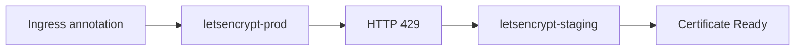

- **Issue.** Certificate issuance failed with HTTP 429, too many certificates. cert-manager reported retry after 2026-07-31 23:55:01 UTC. No new certs until then.
- **Diagnosis.** The prod issuer hit Let's Encrypt limits. The numbers: 50 certs per domain per week, 5 duplicates per week, 300 orders per account per week, 5 failed validations per hostname per hour. Iterative testing against prod burns the quota fast.
- **Resolution.** Switched iterative testing to letsencrypt-staging. Staging exposes the same ACME API with far higher limits. Prod issuance is reserved for real certificates.
- **Command.** `kubectl edit clusterissuer letsencrypt`, then set `spec.acme.server` to `https://acme-staging-v02.api.letsencrypt.org/directory`. Check state with `kubectl describe certificate -n boutique`.

## Lesson 2: Linkerd identity certs

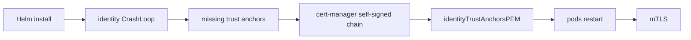

- **Issue.** The identity pod failed with `"Failed to read trust anchors: no certificates found"`. Proxies failed with `"LINKERD2_PROXY_IDENTITY_TRUST_ANCHORS must be set"`. Both crashed.
- **Diagnosis.** The linkerd-control-plane Helm chart requires pre-generated issuer certs. The CLI auto-generates them. Helm does not. Without trust anchors, identity crashes and every proxy refuses to start.
- **Resolution.** Built the chain with cert-manager. A self-signed ClusterIssuer `linkerd-selfsigned` issues the trust anchor Certificate `linkerd-trust-anchor` (`CN root.linkerd.cluster.local`, `isCA`, `ECDSA P-256`). Issuer `linkerd-trust-anchor-issuer` signs the identity Certificate `linkerd-identity-issuer` (`CN identity.linkerd.cluster.local`) into a Secret. Set `identityTrustAnchorsPEM` and `identity.issuer.scheme: kubernetes.io/tls` in `clusters/boutique/platform-configs/helm-values/linkerd.yaml`. Deleted linkerd pods for a clean restart.
- **Command.** `kubectl logs -n linkerd deploy/linkerd-identity` shows the trust anchor error. After the fix: `kubectl delete pods -n linkerd --all`. Verify with `linkerd check`.

## Lesson 3: ACME HTTP-01 blocked by NetworkPolicy

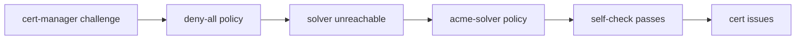

- **Issue.** The challenge stuck at "failed to perform self check". nginx returned 404 and 504 on `/.well-known/acme-challenge`. Solver pods ran, but ingress could not reach them.
- **Diagnosis.** A deny-all NetworkPolicy dropped traffic from ingress-nginx to the solver pods. cert-manager created the pods fine. The self-check comes from the ingress controller, and that path was blocked.
- **Resolution.** Applied `apps/boutique/network-policies/network-policy-acme-solver.yaml`. It allows the ingress-nginx namespace to reach pods labeled `acme.cert-manager.io/http01-solver=true` on TCP 8089.
- **Command.** `kubectl describe challenge -A` shows the stuck self-check. Then `kubectl apply -f apps/boutique/network-policies/network-policy-acme-solver.yaml`.

## Lesson 4: Grafana crash

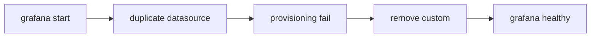

- **Issue.** Grafana crashed in CrashLoopBackOff. The readiness probe failed with connection refused on :3000.
- **Diagnosis.** Two default Prometheus datasource definitions. Provisioning failed on the duplicate, and Grafana never became ready.
- **Resolution.** Removed the conflicting datasource definitions. kube-prometheus-stack now manages the datasource lifecycle end to end.
- **Command.** `kubectl logs -n monitoring deploy/grafana` shows the provisioning failure. `kubectl get pods -n monitoring -l app.kubernetes.io/name=grafana` tracks the rollout.

## Lesson 5: Loki deployment mode

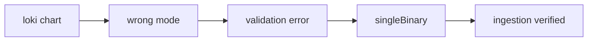

- **Issue.** Helm validation error. `helm template` refused to render, and Argo CD syncs failed.
- **Diagnosis.** The chart validates deployment mode. Distributed components stayed configured while the intent was a single instance. Mixed modes fail validation.
- **Resolution.** Set `deploymentMode: SingleBinary` and zeroed the distributed replicas. Verified the ingestion pipeline with a test push.
- **Command.** `helm template loki grafana/loki --values clusters/boutique/platform-configs/helm-values/loki.yaml > /dev/null` catches the error. Verify with `curl -X POST http://loki-gateway.loki.svc.cluster.local/loki/api/v1/push`.

## Lesson 6: Alloy log collection

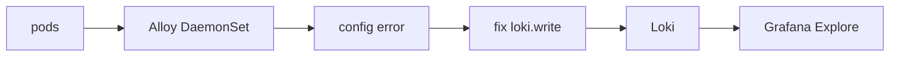

- **Issue.** No logs in Loki. Grafana Explore returned nothing for any namespace.
- **Diagnosis.** The initial Alloy config prevented forwarding. Discovery ran, but the write path was broken, so nothing reached Loki.
- **Resolution.** Fixed the `loki.write` block in `clusters/boutique/platform-configs/helm-values/alloy.yaml`. Validated Alloy component health first, then confirmed Loki write metrics, then verified logs in Grafana Explore. Sender first, receiver second, query last.
- **Command.** `kubectl port-forward -n alloy svc/alloy 12345` opens the component graph. `kubectl logs -n alloy ds/alloy` shows config errors.

## Lesson 7: PrometheusRule discovery

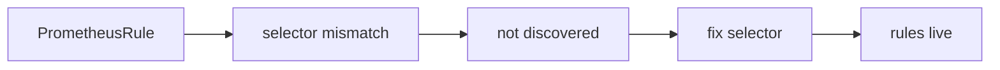

- **Issue.** Rules were written, committed, and synced. Prometheus never evaluated them. No alerts fired, and the UI showed no new rules.
- **Diagnosis.** Selector mismatch. The Prometheus instance only picks up rules that match its `ruleSelector`. The rules also sat in the wrong GitOps location, outside the operator's watch path.
- **Resolution.** Fixed the rule selectors and moved the resources to the right GitOps placement under `clusters/boutique/platform-configs/monitoring/`. Confirmed discovery in the Prometheus UI.
- **Command.** `kubectl get prometheus -n monitoring -o yaml | grep ruleSelector` shows the expected label. `kubectl get prometheusrules -A` lists what the operator can see.

## Lesson 8: Linkerd Viz APIService

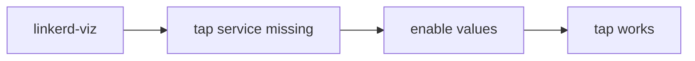

- **Issue.** "service/tap in linkerd-viz is not present" and ServiceNotFound. `linkerd viz` commands failed.
- **Diagnosis.** The linkerd-viz chart (30.12.11) ships with the tap components disabled by default. The APIService pointed at a service that did not exist.
- **Resolution.** Enabled tap, tapInjector, metricsAPI, dashboard, and prometheus in the linkerd-viz values (`clusters/boutique/infrastructure-apps/linkerd-viz.yaml`). Ensured CRDs are applied before the chart.
- **Command.** `kubectl get svc -n linkerd-viz tap` returns NotFound before the fix. After: `linkerd viz tap deploy/checkoutservice`.

Lessons 9 through 15. Each one cost real debugging time. The pattern repeats: configuration, not code.

## Lesson 9: ArgoCD sync ordering for Linkerd

- **Issue.** ArgoCD synced all Linkerd apps at once. The control plane crashed and restarted in a loop.
- **Diagnosis.** Linkerd has a hard install order. CRDs first, then the identity certificates, then the control plane. Without the certs, the identity component cannot start.
- **Resolution.** Enforced ordering with sync waves. `linkerd-crds` syncs first, then `certificates`, then `linkerd-cp`. Each app waits for the previous wave to finish.
- **Command.** `linkerd check` verifies the control plane is healthy after the ordered sync.

## Lesson 10: Kyverno CEL matchConditions and the namespace path

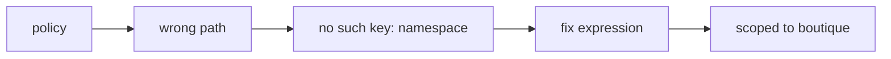

- **Issue.** A CEL-based Kyverno policy matched nothing, or matched the wrong objects. Evaluation failed with `no such key: namespace`.
- **Diagnosis.** CEL evaluates against the admitted object, not a pod template. The namespace lives at `object.metadata.namespace`. The path `object.spec.template.metadata.namespace` does not exist on a Pod, so the expression evaluated to unset.
- **Resolution.** Fixed the expression path and scoped the policy to the `boutique` namespace. Platform workloads like Prometheus and sealed-secrets are not blocked.
- **Command.** `kubectl get validatingpolicy -A -o yaml` to inspect the match conditions and scope.

## Lesson 11: ArgoCD targetRevision "HEAD" does not resolve

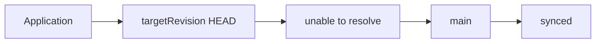

- **Issue.** The ArgoCD Application never synced. The error said the revision could not be resolved.
- **Diagnosis.** `HEAD` is not a Git ref that the ArgoCD repo server can resolve. The remote does not return HEAD as a ref.
- **Resolution.** Changed `targetRevision` to `main`. Every Application in this repo now pins the branch name.
- **Command.** `argocd app set boutique --revision main`.

## Lesson 12: Terraform two-stack pattern

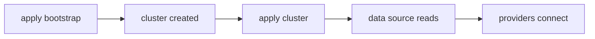

- **Issue.** One Terraform module created the cluster and configured the inside. Apply failed with provider configuration errors.
- **Diagnosis.** Provider configuration cannot depend on resources in the same module. The kubernetes and helm providers need the kubeconfig before the cluster exists.
- **Resolution.** Split into two stacks. The bootstrap stack creates the cluster. The cluster stack reads it through a data source and connects the providers.

## Lesson 13: nginx LoadBalancer IP and DNS chicken-and-egg

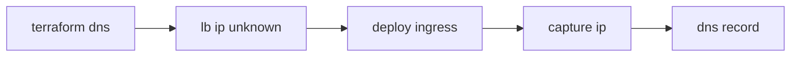

- **Issue.** DNS records could not be created. The Terraform DNS module had no IP for the ingress.
- **Diagnosis.** The LoadBalancer IP only exists after nginx-ingress deploys. DNS needs the IP, so the ordering fails.
- **Resolution.** Captured the IP once and pinned it in `terraform.auto.tfvars` as `lb_ip = "129.212.153.70"`. Applied in order: ingress first, then DNS.
- **Command.** `kubectl get svc -n ingress-nginx ingress-nginx-controller -o jsonpath='{.status.loadBalancer.ingress[0].ip}'`.

## Lesson 14: Sealed Secrets kubeseal connectivity

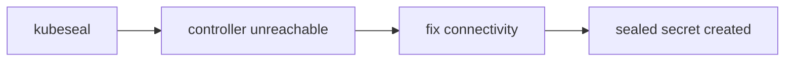

- **Issue.** `kubeseal` failed with `cannot get sealed secret service`.
- **Diagnosis.** kubeseal talks to the sealed-secrets controller in-cluster. It could not reach the service.
- **Resolution.** Fixed the connectivity between the client and the controller, then reran kubeseal.
- **Command.** `kubeseal --format yaml < secret.yaml > sealed-secret.yaml`.

## Lesson 15: Kyverno imagePullSecrets for DOCR

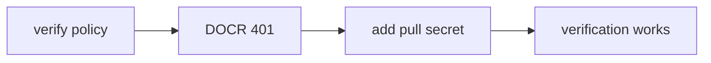

- **Issue.** The verify-image-signature policy returned 401 Unauthorized when pulling from DOCR.
- **Diagnosis.** Kyverno pulls the image to verify the signature. The pull from the private DOCR registry needs credentials.
- **Resolution.** Created the `docr-secret` dockerconfigjson in the kyverno namespace and referenced it through `imagePullSecrets` in the policy. Until then the policy runs in Audit mode.
- **Command.** `kubectl -n kyverno create secret docker-registry docr-secret --docker-server=registry.digitalocean.com --docker-username=<token> --docker-password=<token>`.

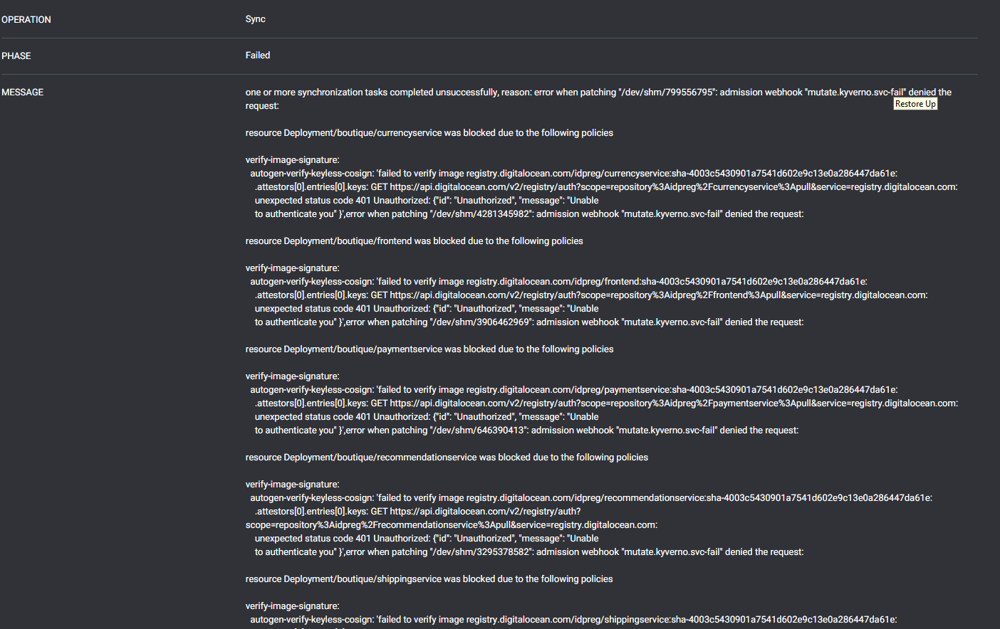

# What I would do differently

- Use the staging issuer from day one. Production ACME rate limits are unforgiving.
- Generate the Linkerd certificates before the Helm install. Never let the chart start without them.
- Add the acme-solver network policy before the first certificate. Deny-all blocks the solver silently.
- Provision the DOCR pull secret before enabling image verification. The 401 is predictable.
- Pin all chart versions. Reproducible installs beat latest.
