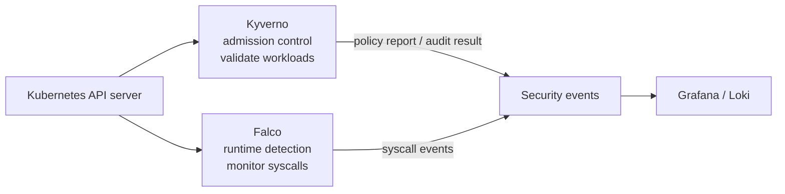
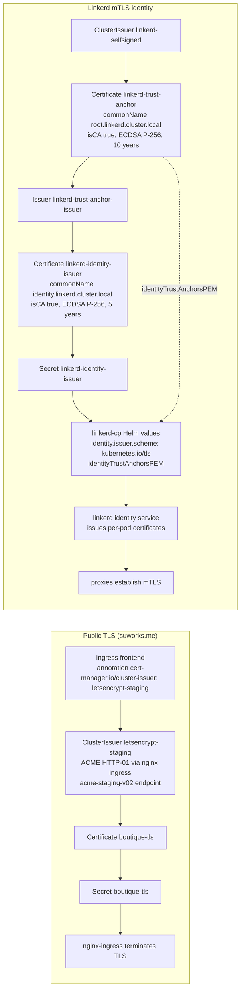
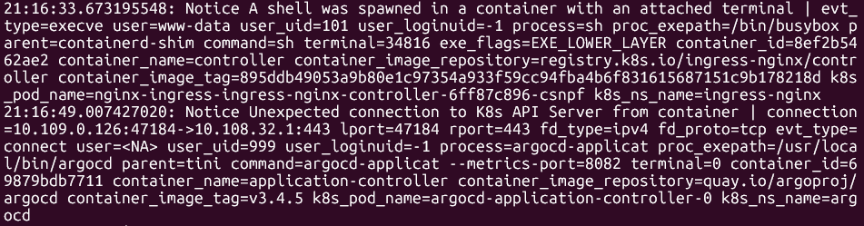

# Security

The boutique cluster runs on DigitalOcean Kubernetes (DOKS), Kubernetes 1.35, managed entirely through GitOps with Argo CD. Security is layered: admission-time policy enforcement with Kyverno, runtime detection with Falco, network microsegmentation with Kubernetes NetworkPolicies (enforced by the Cilium CNI that DOKS ships), automated TLS with cert-manager, service mesh mTLS with Linkerd, and signed container images with Cosign.

The controls are independent of each other. A workload that passes admission is still constrained by its NetworkPolicy, its traffic is still encrypted by Linkerd, and its behavior is still monitored by Falco. No single control is trusted on its own.

## Security architecture

Kyverno intercepts every Pod create and update at admission time and validates it against the policy set described below. Falco runs as a DaemonSet on every node and watches syscalls with eBPF; suspicious behavior is emitted as JSON events. Both feed the observability stack (Grafana, Prometheus, Loki) so security findings are visible in the same place as application metrics and logs.

## Certificate architecture

Two independent certificate hierarchies exist in the cluster: public TLS for ingress, and the Linkerd identity chain for mesh mTLS. They never meet. cert-manager owns both.

The left flow ends at the ingress controller: the browser sees a Let's Encrypt certificate, and nginx terminates TLS at the edge. The right flow ends at the mesh: Linkerd proxies carry short-lived identity certificates issued by the identity service, and every pod-to-pod connection is mTLS. Both flows are detailed below.

## TLS (public ingress certificates)

cert-manager (chart 1.21.0, `cert-manager` namespace, `clusters/boutique/infrastructure-apps/cert-manager.yaml`) issues certificates automatically. `clusters/boutique/platform-configs/cert-manager/letsencrypt-issuer.yaml` defines the `letsencrypt-staging` ClusterIssuer:

- ACME server: `https://acme-staging-v02.api.letsencrypt.org/directory` (staging, not production)
- ACME account key stored in the `letsencrypt-staging` secret (`privateKeySecretRef`)
- Challenge: HTTP-01, routed through the `nginx` ingress class

Ingresses reference the issuer with the `cert-manager.io/cluster-issuer: letsencrypt-staging` annotation:

- `frontend` ingress (`apps/boutique/frontend.yaml`): `suworks.me` and `www.suworks.me`, certificate stored in the `boutique-tls` secret, `ssl-redirect: true`
- Argo CD: `argocd.suworks.me`
- Grafana: `grafana.suworks.me` with forced SSL redirect

The certificate lifecycle is fully declarative. Annotate the ingress, cert-manager reads the ClusterIssuer, solves the HTTP-01 challenge through nginx, writes the secret, and nginx-ingress terminates TLS and reloads. No manual certificate uploads.

Because the issuer is the Let's Encrypt staging endpoint, the issued certificates are test certificates. Browsers will not trust them. Switching to production is a one-line change to the issuer `server` URL, plus removing staging trust from clients. Do that only after the workload is stable; see the rate limit section.

## Let's Encrypt rate limits (the cap you hit)

Let's Encrypt has two ACME endpoints:

- Production: `https://acme-v02.api.letsencrypt.org/directory`
- Staging: `https://acme-staging-v02.api.letsencrypt.org/directory` (what this cluster uses)

Both enforce rate limits. The ones that matter for this build:

| Limit | Production | What it counts |
|---|---|---|
| Certificates per registered domain | 50 per week | New certificates issued for a domain, counting every issuance |
| Duplicate certificates | 5 per week | Requests for the exact same set of hostnames with the same key |
| New orders per account | 300 per week | Orders created, successful or not |
| Failed validations | 5 per hour per hostname | Validation attempts that fail |

The weekly limits roll on a sliding 7-day window, not a calendar week. When you exhaust one, the ACME server answers `HTTP 429` with a `Retry-After` header, and there is nothing to do but wait until the window rolls over. There is no reset endpoint and no way to buy headroom.

During the build this was hit directly. The ACME server answered `HTTP 429` with `Retry-After: 2026-07-31 23:55:01 UTC`. That timestamp is when the rolling window for the exhausted limit reset. The likely culprit is the duplicate certificate limit: every sync or re-request of the same domain set (`boutique-tls` for `suworks.me` plus `www.suworks.me`, `argocd.suworks.me`, `grafana.suworks.me`) counts as a duplicate, and staging enforces that limit too.

The staging environment runs the same limits at far higher thresholds (30,000 certificates per registered domain per week, 60,000 new orders per account per week). The strategy is therefore: iterate against staging until the configuration is stable, then flip to production once. In production, renewals are the only steady-state traffic, and 50 certificates per domain per week is plenty for that. Treat the production endpoint as the release gate, not the dev loop.

## Linkerd certificate creation (the hard part)

Linkerd's identity chain is bootstrapped with cert-manager, and it is the fiddliest part of the mesh install. The reason is Helm.

`linkerd install` (the CLI) generates the trust anchor and identity issuer certificates on the fly and wires them into the manifests it prints. The Helm chart (`linkerd-control-plane`, chart 1.16.11, `clusters/boutique/infrastructure-apps/linkerd-cp.yaml`) has no such step. It renders manifests only. It expects the trust anchor PEM and the identity issuer secret to already exist when it runs. So with Helm you must pre-generate the identity material, declaratively, and that is exactly what `clusters/boutique/platform-configs/cert-manager/linkerd-issuer.yaml` does. Four resources, in order:

1. `linkerd-selfsigned` ClusterIssuer. A self-signed issuer (`selfSigned: {}`). It is the root of the whole chain and signs only the trust anchor.
2. `linkerd-trust-anchor` Certificate, namespace `linkerd`. `commonName: root.linkerd.cluster.local`, `isCA: true`, ECDSA P-256 (`algorithm: ECDSA`, `size: 256`), `duration: 87600h` (10 years), `renewBefore: 360h` (15 days). Issued by `linkerd-selfsigned`. Its secret is the mesh trust anchor.
3. `linkerd-trust-anchor-issuer` Issuer, namespace `linkerd`. A CA issuer backed by the trust anchor secret. It bridges the root to the identity certificate so cert-manager signs from the root rather than from a second self-signed key.
4. `linkerd-identity-issuer` Certificate, namespace `linkerd`. `commonName: identity.linkerd.cluster.local`, `isCA: true`, ECDSA P-256, `duration: 43800h` (5 years), `renewBefore: 720h` (30 days), usages `cert sign`, `crl sign`, `server auth`, `client auth`. Issued by `linkerd-trust-anchor-issuer`. Its secret is what the control plane mounts.

The Helm values (`clusters/boutique/platform-configs/helm-values/linkerd.yaml`) reference the result in two places:

- `identityTrustAnchorsPEM`: the root CA, embedded as PEM. The PEM in the repo decodes to `CN=root.linkerd.cluster.local`, valid 2026-07-31 through 2036-07-28. That is the trust anchor, not the identity issuer.
- `identity.issuer.scheme: kubernetes.io/tls` with `identity.issuer.tls.secretName` pointing at the identity issuer secret. `identityTrustDomain: cluster.local`.

The two must match. Every proxy and the identity service validate peer certificates against `identityTrustAnchorsPEM`. If the PEM is not the exact root that signed the identity issuer secret, the mesh rejects the chain and handshakes fail. The PEM must be the issuer of the issuer.

The failure symptoms are specific and were seen during the build:

- Proxy: `LINKERD2_PROXY_IDENTITY_TRUST_ANCHORS must be set`. The proxy container refuses to start because the environment variable that carries the anchors is empty.
- Identity: `Failed to read trust anchors: no certificates found`. The identity service parsed the PEM value and found no certificate blocks in it.

Both have the same root cause: the control plane was installed without a usable trust anchor. The fix is the order of operations. Let cert-manager create the four resources first, confirm both secrets exist, then install `linkerd-cp`. The values must embed the generated root and name the generated identity secret; never paste a placeholder.

Renewal is automatic from there. cert-manager rotates the identity issuer 30 days before expiry, and the secret name stays the same, so the mesh keeps working. The trust anchor rotates only every 10 years, and when it does, `identityTrustAnchorsPEM` must be updated in the same change. The two rotate on different clocks; treat the anchor rotation as a rare, planned operation.

## Linkerd mTLS

Linkerd encrypts pod-to-pod traffic. Three Argo CD Applications deploy it in sync waves: `linkerd-crds` (chart 1.8.0, wave 1), `linkerd-cp` (`linkerd-control-plane` chart 1.16.11, wave 3), and `linkerd-viz` (chart 30.12.11, wave 4) for dashboards, tap, and metrics.

Identity comes from the chain in the previous section. The `linkerd` identity service mounts the identity issuer secret, signs short-lived per-pod certificates, and proxies present them to each other. Every mesh connection is mTLS-authenticated and encrypted, with `cluster.local` as the trust domain.

The mesh is opted in per workload. The `boutique` namespace carries the `linkerd.io/inject=enabled` label (created by Terraform in `terraform/cluster/main.tf`), and each Deployment template is annotated `linkerd.io/inject: "enabled"`. Proxies listen on inbound port 4143 and admin port 4191, which is why the Linkerd network policies below exist.

## Kyverno admission policies

Kyverno (chart 3.8.2, `clusters/boutique/infrastructure-apps/kyverno.yaml`) enforces the policy set at admission time. The `kyverno-custom-policies` Argo CD Application syncs `clusters/boutique/platform-configs/kyverno/policies` into the `kyverno` namespace (sync wave 2). All policies run in **Audit** mode: violations are reported, nothing is blocked.

The complete policy set is eight policies. Seven are deployed. The eighth, `verify-image-signature`, lives in `clusters/boutique/platform-configs/disabled/` temporarily; it is part of the set and will be restored by moving it into `platform-configs/kyverno/policies` and letting Argo CD sync it.

| Policy | File | Kind | Enforces | Mode |
|---|---|---|---|---|
| `require-run-as-nonroot` | `require-nonroot.yaml` | ValidatingPolicy (CEL, `policies.kyverno.io/v1alpha1`) | `runAsNonRoot: true` at pod or container level | Audit |
| `drop-all-capabilities` | `drop-all-capabilities.yaml` | ValidatingPolicy (CEL, `v1alpha1`) | Every container drops `ALL` Linux capabilities | Audit |
| `require-pod-probes` | `require-probes.yaml` | ValidatingPolicy (CEL, `v1beta1`) | Every container has a liveness, readiness, or startup probe | Audit |
| `require-requests-limits` | `require-resource-limits.yaml` | ValidatingPolicy (CEL, `v1`) | CPU and memory requests plus memory limits on every container | Audit |
| `require-ro-rootfs` | `require-readonly-rootf.yaml` | ValidatingPolicy (CEL, `v1`) | `readOnlyRootFilesystem: true` on every container | Audit |
| `restrict-latest-tag` | `restrict-latest-tag.yaml` | ClusterPolicy (`kyverno.io/v1`) | Images must not use the `latest` tag | Audit |
| `restrict-seccomp` | `restrict-seccomp.yaml` | ValidatingPolicy (CEL, `v1alpha1`) | Seccomp profile unset, `RuntimeDefault`, or `Localhost`; never `Unconfined` | Audit |
| `verify-image-signature` | `disabled/verify-image-sig.yaml` | ClusterPolicy (`kyverno.io/v1`) | Cosign signature check on `registry.digitalocean.com/idpreg/*` images | Audit |

Six of the seven deployed policies are Kyverno 1.14+ CEL `ValidatingPolicy` resources; `restrict-latest-tag` is a legacy `ClusterPolicy`. The disabled `verify-image-signature` is also a `ClusterPolicy`; see the supply chain section for what it enforces and why it is disabled.

The boutique workloads already satisfy the enforceable subset: the service manifests set `runAsNonRoot`, drop `ALL` capabilities, set `allowPrivilegeEscalation: false`, `readOnlyRootFilesystem: true`, resource requests and limits, and gRPC readiness and liveness probes. The image tags are SHA-pinned by the CI pipeline, so `restrict-latest-tag` passes as well.

## Supply chain and image verification

Every container image is built, scanned, and signed in CI before it is allowed anywhere near the cluster.

The pipeline lives in the application repository (`online-boutique-app/.github/workflows/ci-main.yml`):

1. Build all services with `docker compose`.
2. Tag images with the Git commit SHA (`sha-<commit>`).
3. Scan with Trivy (HIGH and CRITICAL severities).
4. Push to the DigitalOcean Container Registry (`registry.digitalocean.com/idpreg`).
5. Sign each image with Cosign: `cosign sign --key env://COSIGN_PRIVATE_KEY`. The private key is stored as a GitHub Actions secret; it never touches the cluster.
6. Check out the infrastructure repo, run `kustomize edit set image` to pin the new SHA tags in `apps/boutique/kustomization.yaml`, and push. Argo CD picks up the change and syncs.

The matching public key is checked into the repo at `clusters/boutique/platform-configs/kyverno/cosign.pub` (ECDSA P-256, the standard Cosign key type).

The verification policy is defined in `clusters/boutique/platform-configs/disabled/verify-image-sig.yaml`:

- `kind: ClusterPolicy`, name `verify-image-signature`, `validationFailureAction: Audit`, `webhookTimeoutSeconds: 30`
- Rule `verify-keyless-cosign`: matches Pods whose images match `registry.digitalocean.com/idpreg/*`
- Verification key: the embedded ECDSA P-256 public key, identical to `cosign.pub`
- `imagePullSecrets: [docr-secret]`: Kyverno needs registry credentials to pull the image from DOCR before it can check the signature
- `allowInsecureRegistry: false`, `mutateDigest: false`

Two honest caveats about the current state:

- The rule name says "keyless", but the implementation is key-based: a static public key, not Sigstore keyless verification. The name is misleading; the behavior is key verification.
- The policy is **not deployed**. It lives in `platform-configs/disabled/` together with `idpregcred-sealed.yaml`, a SealedSecret containing the DOCR `dockerconfigjson` pull credentials for the `kyverno` namespace. The `kyverno-custom-policies` Argo CD Application only syncs `platform-configs/kyverno/policies`, so this policy is defined but disabled.

The cluster therefore does not yet refuse unsigned images. The intended behavior is: once the DOCR pull secret exists in the `kyverno` namespace, restore the policy to `platform-configs/kyverno/policies` and it verifies every image from `registry.digitalocean.com/idpreg/*` at admission time. Until then it can only run in Audit mode, because image verification requires pulling the image with credentials. The application Deployments already carry `imagePullSecrets: [idpreg]` (a kustomize patch in `apps/boutique/kustomization.yaml`), so workload pulls work; the missing piece is the credential Kyverno itself uses.

## Network policy microsegmentation

The `boutique` namespace defaults to deny-all. `apps/boutique/network-policies/network-policy-deny-all.yaml` applies an ingress and egress deny-all policy to every pod. Every service then gets an explicit allow policy, applied as a kustomize resource set (`apps/boutique/network-policies/kustomization.yaml`):

- Per-service policies for all 11 workloads plus `redis` (e.g. `network-policy-cartservice.yaml` allows ingress only from `frontend` and `checkoutservice` on port 7070; egress unrestricted)
- `network-policy-frontend.yaml` is intentionally open in both directions because it is the public entry point behind the ingress controller
- `network-policy-acme-solver.yaml` defines `allow-acme-solver`: ingress from the `ingress-nginx` namespace on port 8089 to pods labeled `acme.cert-manager.io/http01-solver=true`, which is what lets HTTP-01 challenges complete
- `network-policies/linkerd/` adds the mesh-specific exceptions: `allow-linkerd-proxy` (ingress on proxy ports 4143 and 4191) and `allow-linkerd-control-plane` (egress to the `linkerd` namespace on ports 8086, 8088, 9995)

DOKS uses Cilium as its CNI, and Cilium enforces Kubernetes `NetworkPolicy` objects natively, so these policies are data plane enforced, not just declared.

## Runtime security (Falco)

Falco watches the nodes. The Argo CD Application `falco` (`clusters/boutique/infrastructure-apps/falco.yaml`) installs the `falcosecurity/falco` chart (9.1.0, repo `https://falcosecurity.github.io/charts`) into the `falco` namespace; the chart runs it as a DaemonSet, one pod per node, with automated prune and self-heal sync.

Helm values (`clusters/boutique/platform-configs/helm-values/falco.yaml`):

- `driver.kind: modern_ebpf` - the modern eBPF probe, no kernel module compilation
- `falco.jsonOutput: true` with `jsonIncludeOutputProperty` - machine-readable events
- `falco.stdoutOutput.enabled: true` - events written to stdout

Falco intercepts syscalls on the host at the kernel level and applies its rule set (container spawning a shell, unexpected file writes, privilege escalation attempts, and the rest of the default Falco rules). eBPF means the probe runs sandboxed in the kernel without loading a kernel module, which is what makes it safe and fast on modern DOKS nodes. It is a detection control only: it does not block syscalls.

Current gap: events are emitted to stdout, but no exporter (falcosidekick or similar) is configured in the repo yet, so events are not being forwarded to Loki or Alertmanager. Loki is already deployed (`clusters/boutique/infrastructure-apps/loki.yaml`, chart 7.0.0), so the values are ready to extend; wiring falcosidekick with a Loki output, or tailing the DaemonSet stdout into Loki, is the next step.
